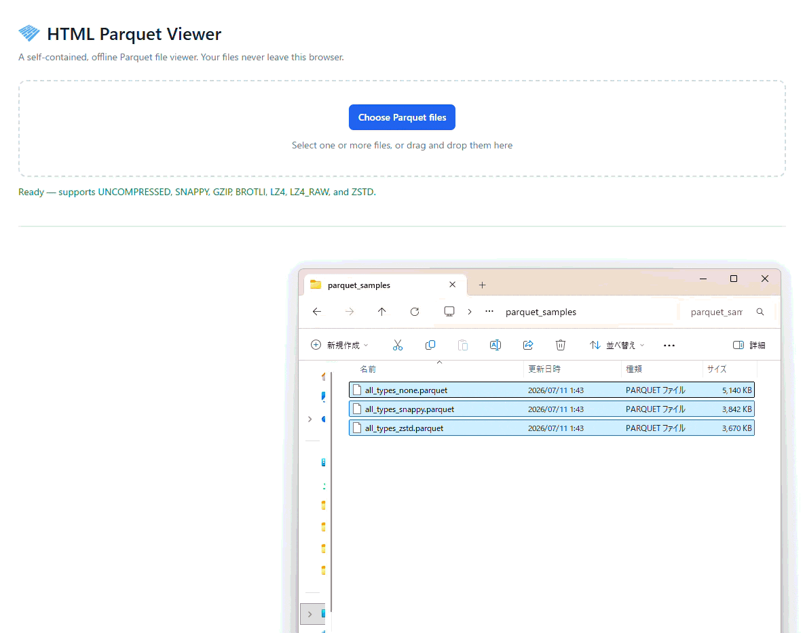

# HTML Parquet Viewer

A self-contained, offline Parquet file viewer delivered as **one HTML file**.

Open the file in a modern browser, select or drop Parquet files, and inspect them locally. No installation, build step, server, CDN, or network connection is required.

## Try it online

Open the hosted viewer:  
https://ttomohisa.github.io/html-parquet-viewer

Your files stay in your browser. Nothing is uploaded.

## Why

Parquet files often need a quick inspection on locked-down workstations, air-gapped networks, or during data-pipeline debugging. This viewer is designed for that job:

- **Single-file distribution** — copy one HTML file anywhere
- **Offline and private** — files stay in your browser
- **Metadata-first preview** — reads the footer and only the requested preview range; it does not eagerly expand the whole file into memory
- **No dependencies at runtime** — scripts, styles, and required codecs are embedded

## Features

- Open one or many local Parquet files from the picker or with drag and drop
- Work with several files at once in closable tabs
- Read Parquet v1 and v2 files
- Support uncompressed, Snappy, Gzip, Brotli, LZ4, LZ4_RAW, and Zstandard data
- Inspect file metadata, schema, row count, row groups, and codecs
- Browse preview rows without loading the entire file
- Choose 50, 100, 250, 500, or 1,000 rows per page
- Jump directly to a page and see `Page N of M`
- Collapse the Schema and Data preview panels
- Display concise type badges such as `text`, `int64`, `time`, and `decimal`
- Distinguish `null` from an empty string without adding noise to empty cells
- Sort the current preview page: ascending → descending → reset
- Copy the current page as CSV
- Explain common read errors in actionable language

## Quick start

1. Download [`parquet-viewer.html`](./parquet-viewer.html) from this repository.
2. Open it in a current Chromium-based browser, Firefox, or Safari.
3. Choose one or more `.parquet` files, or drag them into the drop area.

There is no upload. Your selected files remain local to your browser session.

## Preview behavior

The viewer is intentionally a **preview and inspection** tool, not a full query engine.

- Paging reads the current range of rows from the local file.
- Sorting and any future filtering are explicitly limited to the current preview page.
- The `Copy CSV` action copies the visible page, including its current sort order.
- Opening a new tab does not upload or persist a file; closing/reloading the browser removes the in-memory session.

## UI notes

| Interaction | Behavior |
|---|---|
| Click a column header | Ascending sort for the current page |
| Click it again | Descending sort |
| Click it a third time | Reset to the original read order |
| Click **Schema** or **Data preview** | Collapse or expand that section |
| Click **Copy CSV** | Copy the current preview page to the clipboard |
| Enter a page number | Jump to that page |

## Supported formats

| Item | Support |
|---|---|
| Parquet format | v1 and v2 |
| Compression | Uncompressed, Snappy, Gzip, Brotli, LZ4, LZ4_RAW, Zstandard |
| Files | Local files selected via browser picker or drag and drop |
| Network | Not required; the viewer is designed to run offline |

Support ultimately depends on the encodings used by the file and the embedded parser/codecs. If a file cannot be read, the app distinguishes common cases such as a missing `PAR1` header, a truncated/invalid footer, unsupported encoding or compression, and preview rendering failures.

## Development

The distributable is deliberately a single generated HTML file. If you modify it directly, keep these principles intact:

- Do not add external CDN or network dependencies.
- Keep the Content Security Policy restrictive (`connect-src 'none'`).
- Test with both small and large files, multiple row groups, and compressed input.
- Test the file picker and multi-file drag-and-drop flows.

## License and notices

This repository is intended to be released under the **MIT License**. Add a `LICENSE` file containing the standard MIT text and set GitHub's repository license to MIT.

The embedded Parquet parser is derived from **hyparquet**, which is licensed under MIT. Keep its copyright/license notice in the distribution or provide it in a `THIRD_PARTY_NOTICES.md` file when publishing modified or bundled copies.

“Apache”, “Apache Parquet”, and associated logos are trademarks of the Apache Software Foundation. This project is an independent viewer and is not affiliated with or endorsed by the Apache Software Foundation. Avoid presenting the bundled icon as an official project logo.

## Third-party acknowledgements

- [hyparquet](https://github.com/hyparam/hyparquet) — JavaScript Parquet parser, MIT License
- [hyparquet-compressors](https://github.com/hyparam/hyparquet-compressors) — browser decompression support, MIT License

## Contributing

Bug reports with a reproducible file are welcome. Please remove sensitive data before sharing a Parquet file or provide a minimal synthetic reproduction.
