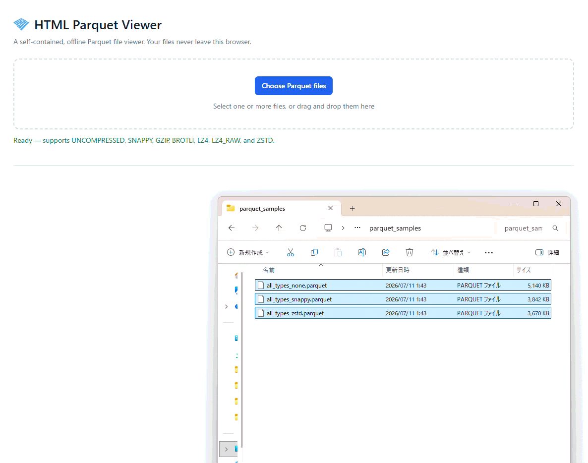

# HTML Parquet Viewer

A self-contained, offline Parquet file viewer delivered as **one HTML file**.

Open the file in a modern browser, select or drop Parquet files, and inspect them locally. No installation, build step, server, CDN, or network connection is required.

## Try it online

Open the hosted viewer:  
[parquet-viewer.html](https://ttomohisa.github.io/html-parquet-viewer/parquet-viewer.html)

Your files stay in your browser. Nothing is uploaded.

## Why

Parquet files often need a quick inspection on locked-down workstations, air-gapped networks, or during data-pipeline debugging. This viewer is designed for that job:

- **Single-file distribution** — copy one HTML file anywhere
- **Offline and private** — files stay in your browser, with network connections blocked by Content Security Policy
- **Metadata-first preview** — reads the footer and only the requested preview range; it does not eagerly expand the whole file into memory
- **No dependencies at runtime** — scripts, styles, and required codecs are embedded

## Features

- Open one or many local Parquet files from the picker or with drag and drop
- Work with several files at once in closable tabs
- Read Parquet v1 and v2 files
- Support uncompressed, Snappy, Gzip, Brotli, LZ4, LZ4_RAW, and Zstandard data
- Inspect file metadata (`created_by` and custom key/value metadata), schema, row count, row groups, and codecs
- Browse preview rows without loading the entire file
- Choose 50, 100, 250, 500, or 1,000 rows per page
- Jump directly to a page and see `Page N of M`
- Collapse the Schema and Data preview panels
- Display concise type badges such as `text`, `int64`, `time`, and `decimal`
- Distinguish `null` from an empty string without adding noise to empty cells
- Sort the current preview page: ascending → descending → reset, with exact signed BigInt ordering
- Find literal values on the current page with matching-row highlights, counts, and previous/next navigation
- Download or copy the current page as CSV
- Explain common read errors in actionable language

## Quick start

1. Download [`parquet-viewer.html`](./parquet-viewer.html) from this repository.
2. Open it in a current Chromium-based browser, Firefox, or Safari.
3. Choose one or more `.parquet` files, or drag them into the drop area.

There is no upload. Your selected files remain local to your browser session.

## Preview behavior

The viewer is intentionally a **preview and inspection** tool, not a full query engine.

- Paging reads the current range of rows from the local file.
- Sorting and finding are explicitly limited to the current preview page. Finding never filters rows or reads another page.
- Find is case-insensitive and searches displayed cell text, including the `null` marker. Empty cells remain empty. Binary values are searched only through their displayed summary (the first 24 bytes), not their hidden bytes.
- Each tab keeps its find query in memory. Page and sort changes reset the current match; loading or failed reads clear old results.
- Files whose metadata cannot be read retain their own error tab, which can be closed.
- Each tab retains its own completed preview and sort order. Switching back does not re-read a completed page.
- CSV actions are disabled while a page is loading or after a read failure. Retry by entering the page number again or choosing a smaller page size.
- The `Download CSV` and `Copy CSV` actions use the visible page, including its current sort order.
- Opening a new tab does not upload or persist a file; closing/reloading the browser removes the in-memory session.

## UI notes

| Interaction | Behavior |
|---|---|
| Click a column header | Ascending sort for the current page |
| Click it again | Descending sort |
| Click it a third time | Reset to the original read order |
| Click **Schema**, **File metadata**, or **Data preview** | Collapse or expand that section |
| Click **Download CSV** | Download the current preview page as a UTF-8 CSV file |
| Click **Copy CSV** | Copy the current preview page to the clipboard (with a local-file fallback) |
| Enter a page number | Jump to that page |
| Type in **Find values on this page** | Highlight matching rows without changing CSV contents or order |
| Press Enter / Shift+Enter in Find | Move to the next / previous matching row, wrapping within this page |
| Press Escape in Find or click **Clear** | Remove the query and highlights |

## Supported formats

| Item | Support |
|---|---|
| Parquet format | v1 and v2 |
| Compression | Uncompressed, Snappy, Gzip, Brotli, LZ4, LZ4_RAW, Zstandard |
| Files | Local files selected via browser picker or drag and drop |
| Network | Not required; the viewer is designed to run offline |

Support ultimately depends on the encodings used by the file and the embedded parser/codecs. If a file cannot be read, the app distinguishes common cases such as a missing `PAR1` header, a truncated/invalid footer, unsupported encoding or compression, and preview rendering failures.

## Development

The distributable is deliberately a single generated HTML file. If you modify it directly, keep these principles intact:

- Do not add external CDN or network dependencies.
- Keep the Content Security Policy restrictive (`connect-src 'none'`) and do not comment it out.
- Test with both small and large files, multiple row groups, and compressed input.
- Test the file picker and multi-file drag-and-drop flows.

### Catalog metadata

`app.config.json` declares `versionPolicy: "unversioned"` deliberately: the app has no semantic release version, version badge, or build step. The `build.output` field identifies the already-shipped `parquet-viewer.html`; it does not introduce a builder. `build.blockRuntimeNetwork: true` records the existing restrictive CSP. The default UI is English. The canonical catalog screenshots (`assets/screenshot.png` and `assets/screenshot-en.png`) reuse the genuine English demo capture in `assets/demo.png`, showing the bundled synthetic Parquet sample.

### State regression checks

Run `node --test tests/*.test.cjs` with Node.js 22 or newer. No packages or build step are needed.

The tests evaluate the application functions extracted from the shipped HTML, using a small DOM adapter, deferred parser-boundary doubles and fictitious row values. They cover tab/request ownership, metadata and page failures, page/CSV identity, retry, sorting, navigation, empty results and clipboard callbacks. Find checks cover literal/display-format matching, row navigation, tab/page ownership, and unchanged CSV/read behavior. BigInt checks cover signed INT64 extremes and adjacent values beyond Number precision. Contract checks preserve the embedded parser/codecs, CSP and notices, and syntax-check the complete inline script.

These checks do not parse real Parquet, use a file picker or validate browser layout and interaction. The manual file and browser checks above are still needed before release.

## License and third-party notices

Copyright (c) 2026 Tomohisa Takagi

This project is licensed under the [MIT License](LICENSE).

This distribution bundles or derives from third-party software, including
[hyparquet](https://github.com/hyparam/hyparquet) and
[hyparquet-compressors](https://github.com/hyparam/hyparquet-compressors).
See [THIRD_PARTY_NOTICES.md](THIRD_PARTY_NOTICES.md) for the applicable
copyright notices and license texts.

“Apache”, “Apache Parquet”, and associated logos are trademarks of the Apache Software Foundation. This project is an independent viewer and is not affiliated with or endorsed by the Apache Software Foundation. Avoid presenting the bundled icon as an official project logo.

## Third-party acknowledgements

- [hyparquet](https://github.com/hyparam/hyparquet) — JavaScript Parquet parser, MIT License
- [hyparquet-compressors](https://github.com/hyparam/hyparquet-compressors) — browser decompression support, MIT License

## Contributing

Bug reports with a reproducible file are welcome. Please remove sensitive data before sharing a Parquet file or provide a minimal synthetic reproduction.
